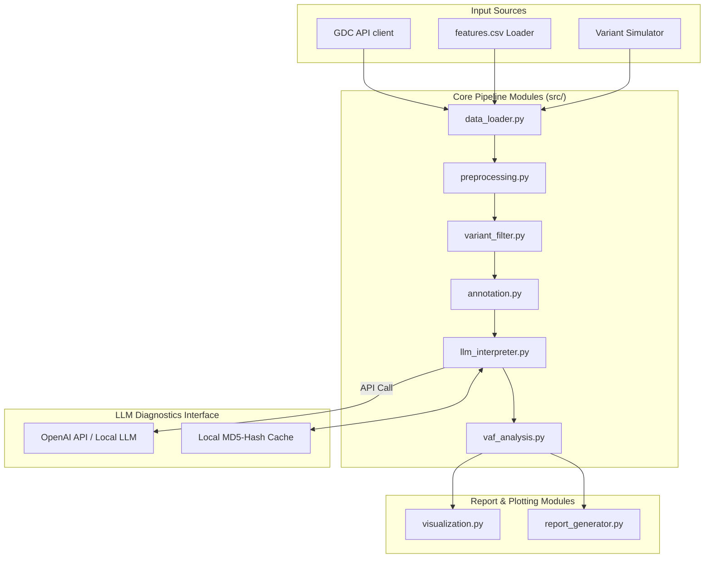
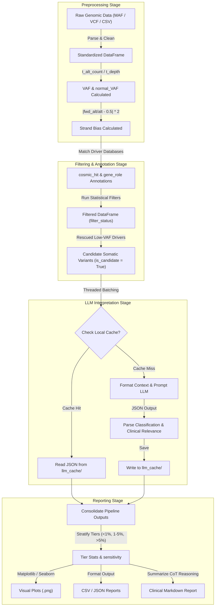

# LLM-Assisted ctDNA Somatic Mutation Caller for Low-VAF Detection

An intelligent, end-to-end bioinformatics pipeline that identifies low-frequency somatic mutations (Variant Allele Frequency, VAF < 5%) in circulating tumor DNA (ctDNA) using rule-based statistical filters combined with clinical Large Language Model (LLM) reasoning. 

This pipeline replaces traditional machine learning classifiers (which suffer in extremely low-VAF, high-class-imbalance regimes) with a hybrid heuristic-filtering and LLM-assisted approach. It is built in modular Python for direct integration into PyCharm.

---

## Key Features

1. **GDC API Downloader**: Programmatically queries the NCI Genomic Data Commons (GDC) to fetch public, open-access Masked Somatic Mutation datasets (e.g. `TCGA-LUAD`) in MAF format.
2. **Multi-Format Loader**: Parses MAF, CSV, and VCF files. Includes a robust **pure-Python VCF parser** designed to bypass compilation and library dependencies (like `pysam`) which often fail on Windows.
3. **High-Fidelity Variant Simulator**: Generates realistic synthetic MAF and VCF files containing true low-VAF somatic calls (0.1%–5.0% VAF), matched germline control leakages, and sequencing artifacts with extreme strand bias for testing.
4. **Driver Rescue Heuristic**: Salvages ultra-low VAF mutations (0.1%–0.5% VAF) that are normally filtered out by raw caller cutoffs, provided they occur in key cancer driver genes (e.g., *EGFR*, *TP53*) and show clean, unbiased sequencing quality.
5. **LLM-Assisted Classification & Caching**: Sends candidate mutations to OpenAI-compatible models (e.g. `gpt-4o-mini`, DeepSeek, or local Ollama) for Chain-of-Thought clinical annotation. Integrates local response caching (saved as MD5-hashed JSON files in `outputs/llm_cache/`) and multi-threaded parallel requests to optimize latency and costs.
6. **Mock Fallback Mode**: If no OpenAI API key is configured, the pipeline automatically activates a local rules-based simulation classifier to let you test and run the entire pipeline out-of-the-box.
7. **Premium Reporting and Visualizations**: Generates CSV spreadsheets of called mutations, structured JSON stats, beautiful publication-grade plots (VAF distribution, TMB, gene frequency, low-VAF histograms), and a premium Markdown Clinical Interpretation Report.

---

## Project Directory Structure

```text
ctdna_mutation_caller/
│
├── data/                    # Holds reference files (e.g., cancer_gene_census.csv, features.csv)
├── downloads/               # Downloads of real MAF files from GDC API
├── outputs/                 # Directory for pipeline output products
│   ├── llm_cache/           # Locally cached LLM responses (JSON)
│   ├── plots/               # Generated Seaborn/Matplotlib analysis plots
│   └── reports/             # CSV, JSON, and Markdown clinical summaries
│
├── src/                     # Core Python modules
│   ├── data_loader.py       # Data parsers, API downloader, and simulation engine
│   ├── preprocessing.py     # Feature engineering, standardization, and encodings
│   ├── variant_filter.py    # Hard statistical filters & driver rescue rules
│   ├── vaf_analysis.py      # VAF tier stratification and evaluation metrics
│   ├── llm_interpreter.py   # OpenAI API wrapper, caching, mock fallback, and threads
│   ├── annotation.py        # COSMIC matching and biological driver roles
│   ├── visualization.py     # Matplotlib/Seaborn custom plotting suite
│   ├── report_generator.py  # CSV, JSON summary, and Markdown clinical exports
│   └── main.py              # Command-line entry point and orchestrator
│
├── requirements.txt         # Project package dependencies
├── config.py                # Pipeline settings, thresholds, and gene lists
└── README.md                # Documentation (this file)
```

---

## Installation & Setup

### 1. Prerequisite: Install Python
Ensure Python 3.12 (or higher) is installed on your Windows machine. If not, download and install it from the official [Python website](https://www.python.org/downloads/). During installation, make sure to check the box **"Add Python to PATH"**.

### 2. Configure Virtual Environment in PyCharm
Follow these steps to open the project and set up your virtual environment in PyCharm:
1. Open PyCharm.
2. Select **Open** and browse to the directory `c:/Users/shaar/OneDrive/Desktop/ctdna mutation caller project/ctdna_mutation_caller`.
3. Go to **File** > **Settings** (or `Ctrl+Alt+S`).
4. Navigate to **Project: ctdna_mutation_caller** > **Python Interpreter**.
5. Click the gear icon or **Add Interpreter** > **Add Local Interpreter...**
6. Select **Virtualenv Environment**.
7. Keep **New Environment** checked, set the base interpreter to your Python 3.12 path (usually automatically detected), and set the Location to `.venv` inside the project folder. Click **OK**.
8. Open the PyCharm **Terminal** window (usually at the bottom left) and verify it has activated the environment (you should see `(.venv)` in the prompt). If not, activate it manually:
   ```powershell
   .venv\Scripts\Activate.ps1
   ```

### 3. Install Dependencies
In the PyCharm Terminal, execute:
```bash
pip install -r requirements.txt
```

---

## Running the Pipeline

The pipeline is managed via a Command Line Interface (CLI) in `src/main.py`. You can execute it directly from the PyCharm terminal.

### Mode A: Out-of-the-Box Simulation (Recommended for Testing)
To verify everything is working immediately without downloading large files or calling paid APIs, run the simulation mode:
```bash
python src/main.py --mode simulate --simulate-size 150
```
*This generates a simulated dataset (`data/simulated_ctdna.maf`), runs rules-based filtering, activates the Local Mock LLM logic, creates 5 plots in `outputs/plots/`, and outputs reports in `outputs/reports/`.*

### Mode B: Filter and Preprocess Existing Local Data
If you have a local dataset like `features.csv` or a MAF file, pass it via `--input`. For example, to run rule-based filters only:
```bash
python src/main.py --mode filter --input data/features.csv
```

### Mode C: Full Pipeline with Real LLM (OpenAI-compatible)
To run the full pipeline, including sending candidates to a real LLM, provide your API key. You can also specify an `--llm-limit` to prevent excessive API costs during testing:
```bash
# Using OpenAI API
python src/main.py --input data/features.csv --api-key "your-openai-api-key" --llm-limit 15

# Alternatively, set the environment variable in Windows PowerShell first:
$env:OPENAI_API_KEY="your-openai-api-key"
python src/main.py --input data/features.csv --llm-limit 15
```

---

## Customizing Configurations (`config.py`)

You can edit `config.py` in PyCharm to adjust default behaviors:
* **`MIN_DEPTH`**: Increase this (e.g. 50 or 100) if working with high-depth targeted panels.
* **`MIN_VAF`**: Default is `0.005` (0.5%).
* **`MAX_STRAND_BIAS`**: Standard is `0.8`. Skewed artifacts exceeding this are rejected.
* **`LLM_MODEL`**: Adjust to other models like `gpt-4` or local models.
* **`LLM_BASE_URL`**: Change this to point to a local server (e.g. `http://localhost:11434/v1` for Ollama).
* **Driver Gene Lists**: Update `KNOWN_ONCOGENES` and `KNOWN_TUMOR_SUPPRESSORS` to target specific cancer cohorts.

---

## Output Products (`outputs/`)

Each successful run of the pipeline creates the following in the `outputs/` directory:

1. **`outputs/reports/somatic_mutations_called.csv`**: A clean, spreadsheet-ready list containing only called somatic mutations, complete with VAF statistics, driver labels, and LLM classifications.
2. **`outputs/reports/pipeline_run_summary.json`**: Structural metadata and summary statistics of the run, perfect for logging or downstream bioinformatic indexing.
3. **`outputs/reports/clinical_interpretation_report.md`**: A premium clinical report. It highlights high-confidence driver mutations (e.g., somatic hotspots in *EGFR* or *TP53*), and embeds the LLM's clinical reasoning.
4. **`outputs/plots/`**:
   - `01_vaf_distribution.png`: Histogram showing density of VAF across caller categories.
   - `02_tumor_mutation_burden.png`: The count of somatic mutations across patients.
   - `03_gene_frequency.png`: Mutated gene bar chart color-coded by role (Oncogene vs TSG vs Passenger).
   - `04_low_vaf_histogram.png`: Stacked histogram of somatic calls at VAF < 5%.
   - `05_vaf_tier_metrics.png`: Calling rates and sensitivity metrics across VAF tiers (<1%, 1-5%, >5%).

---

## Data Origin and Pipeline Architecture

### Data Origins
The pipeline accepts input mutation datasets from three primary sources:
1. **NCI GDC API (Genomic Data Commons)**: Programmatically fetches public open-access "Masked Somatic Mutation" MAF (Mutation Annotation Format) datasets (e.g. TCGA-LUAD). These mutations are pre-called using Mutect2 and are masked to remove protected germline information.
2. **Patient Cohort Feature CSVs**: Existing clinical mutation tables containing engineered features and tumor/normal coverage information (like the provided `data/features.csv` extracted from `files.zip`).
3. **Synthetic ctDNA Simulator**: A local variant generation engine that designs high-fidelity mock variants (somatic target calls, sequencing chemistry strand artifacts, and normal control germline contamination leakages) with varying low-VAF configurations.

### Pipeline Architecture Diagram
The architecture is structured as follows:



### Data Flow Diagram
The progression and mutation of datasets throughout execution:


